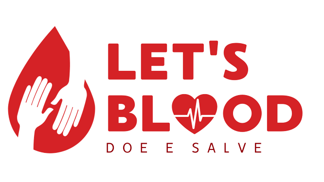

# Let's Blood 

  

O Let's Blood é um banco de dados escrito em MSSQL que tem por objetivo cadastrar doações de sangue e suas respectivas informações. Este banco é composto pelas tabelas Médico, Doador, Bolsa de Sangue, Tipo sanguineo e Hospital. 

Buscou-se utilizar os seguintes conceitos vistos em aula:
- Selects
- Add – Alter
- Update
- Deletes – Drop
- Querys para Pesquisas (JOINS)
- Views
- Triggers
- Procedures
- Functions
- Funções Agregadas

## Executando o projeto 
Para que o Programa funcione, baixe e execute na ordem abaixo: 
1 - Primeiro o arquivo: [CRUD_LetsBlood.sql](CRUD_LetsBlood.sql) 
2 - Depois o arquivo: [INSERTS_LetsBlood.sql](INSERTS_LetsBlood.sql) 
3 - Por ultimo execute os comandos desejados do arquivo: [COMANDOS_LetsBlood.sql](COMANDOS_LetsBlood.sql) 

## Slides da Apresentação 
[Link do Arquivo .pptx](ApresetacaoLetsBlood.pptx) 

## Modelagem do projeto 

### Modelo Conceitual 

  

### Modelo Lógico 

  

### Modelo Físico 

  

